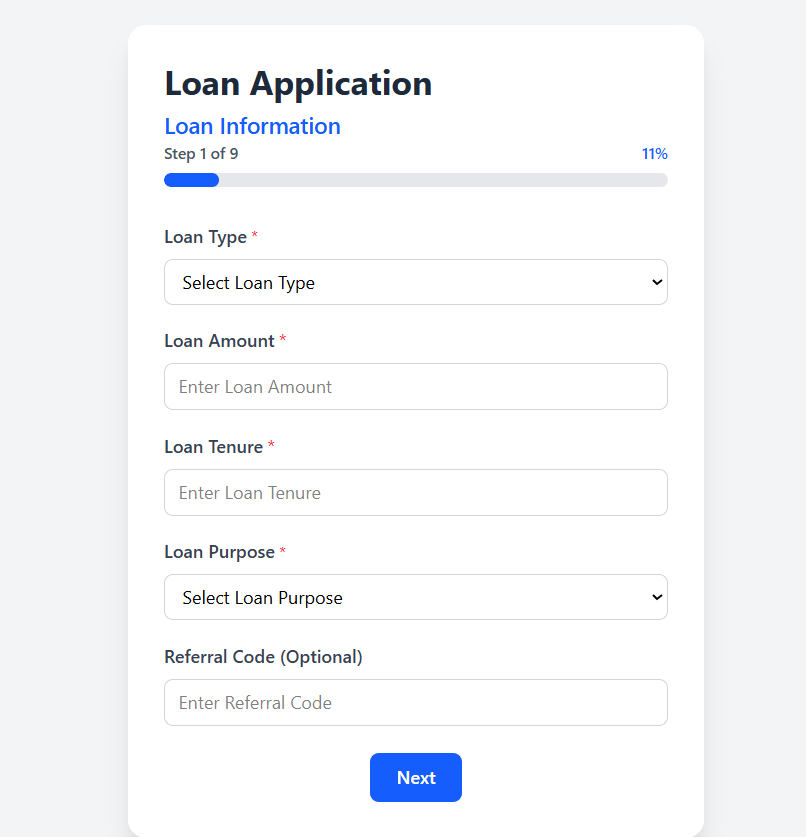
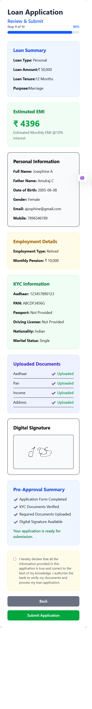
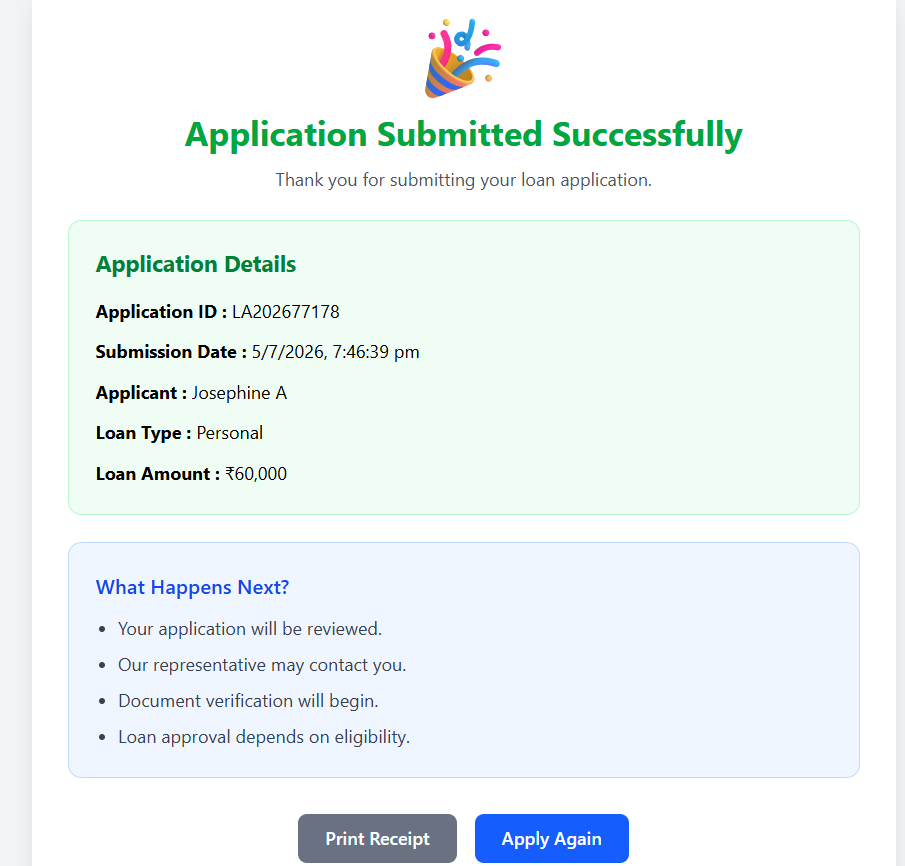

# 🏦 Loan Application Management System

A responsive multi-step Loan Application Form built using **React**, **React Hook Form**, and **Tailwind CSS**. This project simulates a real-world digital loan application process with validation, document upload, declaration, and review before submission.

---

## 📸 Screenshots


### Loan Information


### Review & Submit


### Success Page


---

## ✨ Features

- Multi-step loan application form
- Responsive UI using Tailwind CSS
- React Hook Form validation
- Progress Bar
- Reusable Components
- Loan Information
- Personal Information
- Address Information
- Employment Information
- KYC Verification Form
- Co-Applicant Details
- Document Upload
- Declaration
- Review & Submit
- Success Page

---

## 🛠 Tech Stack

- React
- Vite
- Tailwind CSS
- React Hook Form
- JavaScript
- HTML5
- CSS3

---

## 📂 Folder Structure

src/
├── components/
│ ├── common/
│ ├── step1/
│ ├── step2/
│ ├── step3/
│ ├── step4/
│ ├── step5/
│ ├── step6/
│ ├── step7/
│ ├── step8/
│ ├── step9/
│ └── step10/
├── App.jsx
└── main.jsx

---

## 🚀 Installation

```bash
git clone <repository-url>

cd loan-application-form

npm install

npm run dev
```

---

## 📋 Workflow

Loan Information

↓

Personal Information

↓

Address Information

↓

Employment Information

↓

KYC Information

↓

Co-Applicant Information

↓

Document Upload

↓

Declaration

↓

Review & Submit

↓

Application Submitted

---

## 🎯 Future Enhancements

- Backend Integration (Spring Boot)
- MySQL Database
- REST APIs
- Authentication
- OTP Verification
- PAN Verification API
- Aadhaar Verification API
- Auto Save
- Resume Application
- Email Notification
- PDF Receipt
- Admin Dashboard
- Deployment

---

## 👨‍💻 Author

**Josephine A**

GitHub:
https://github.com/josphin342

